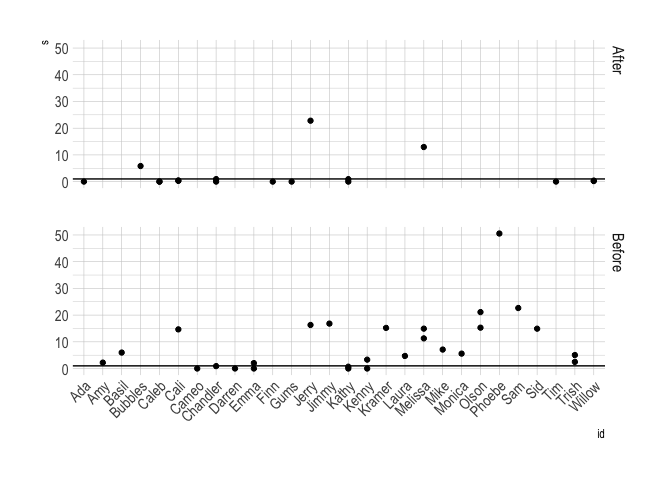
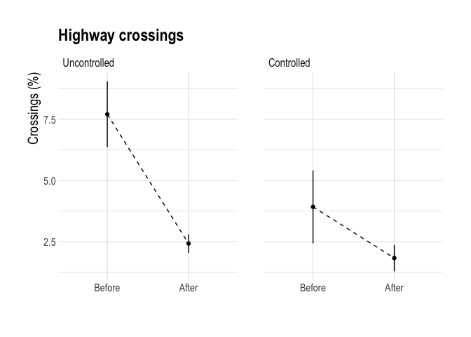

Roadkill Carcass Attraction of Large Carnivores and Solutions
================
Clayton Lamb
11 June, 2021

\#\#\#\#\#WATCH FOR BEFORE AFTER COMPARISONS THAT ARE MORESO ELKO VS
ALEX, NOT AS MUCH ELKO BEFORE/AFTER \#\#\#\#\#WATCH FOR DENNING AND
IMMEDIATELY AFTER CAPTURE LOCS \#\#\#\#\#PROBABLY NEED TO CLEAN CONFLICT
DATA, AND SEE IF SPARWOOD 2019 SPIKE IS AMYS CUB?

# Test for Attraction of Large Carnivores to cameras at pits vs bunkers

## Load Data

``` r
library(here)
library(tidyverse)
library(sf)
library(readxl)
library(lubridate)
library(mapview)
library(ggmap)
library(raster)
library(stars)
library(velox)
library(adehabitatHR)
library(lme4)
library(MuMIn)
library(broom)
library(hrbrthemes)
library(RColorBrewer)
options(scipen=999)

##load data
df <- read_csv(here::here("data","SpeciesRawDownload", "LER_CarcassPits_report.csv"))
deploy <- read_csv(here::here("data","Camera Deployment.csv"))
```

## Prep

``` r
##clean
df <- df%>%
  filter(!common_name %in% c("NONE", "Common Raven", "Deer", "Golden eagle", "Magpie", "STAFF/SETUP","Turkey Vulture","Voles, Mice and Allies", 
                             "Wolves, Coyotes and Allies","Striped Skunk","UNKNOWN"),
         !location%in%"OLSENPITCORNER2018") ##just out for a night, 1 grizz photo, too few nights

##identify distinct events
df <- df%>%
  group_by(location,common_name)%>%
  arrange(date_detected)%>%
  mutate(timedif=c(0.1,diff(date_detected))/60,
         start = timedif > 5,
         event.id=paste(cumsum(start),common_name,location, sep="_"))

##time cameras were out
deploy <- deploy%>%
  mutate(removed=mdy_hm(removed),
         deployed=mdy_hm(deployed),
         dur=removed- deployed)


##create time in front of camera
tif <- df%>%
  dplyr::select(location,date_detected,common_name,age_class,sex,number_individuals, timedif, event.id)%>%
  mutate(night_day=(date_detected-hours(6))%>%yday,
         number_individuals=case_when(number_individuals%in%"VNA"~"1",TRUE~number_individuals)%>%as.numeric)
```

## Plot

``` r
df%>%
  group_by(common_name,location)%>%
  count%>%
  mutate(n=1)%>%
  ggplot(aes(x=location,y=n,fill=common_name))+
  geom_col()+
  theme_ipsum()+
  labs(x="Location", y="Pic count",
       title="Counts")+
  theme(axis.title.y = element_text(size=15),
        axis.title.x = element_text(size=15),
        axis.text.x = element_text(size=12, angle=45,hjust=1),
        strip.text.x = element_text(size=15),
        strip.text.y = element_text(size=15),
        axis.text = element_text(size=10),
        legend.text = element_text(size=13),
        legend.title=element_text(size=15))
```

<!-- -->

``` r
tif%>%
  left_join(tif %>%group_by(event.id)%>%count)%>%
  filter(n>1 & timedif<5)%>%
  mutate(number_individuals=case_when(number_individuals%in%"VNA"~1,TRUE~number_individuals),
         timedif=case_when(n==1~1,TRUE~timedif*as.numeric(number_individuals)))%>%
  group_by(common_name,location)%>%
  summarise(n=sum(timedif))%>%
  left_join(deploy%>%dplyr::select(location,dur,type))%>%
  mutate(hr_days=n/(as.numeric(dur)))%>%
  group_by(type, common_name)%>%
  summarise(hr_days=mean(hr_days))%>%
  ggplot(aes(x=type,y=hr_days,fill=common_name))+
  geom_col()+
  theme_ipsum()+
  labs(x="Location", y="Time per day (minutes)",
       title="Time")+
  theme(axis.title.y = element_text(size=15),
        axis.title.x = element_text(size=15),
        axis.text.x = element_text(size=12, angle=45,hjust=1),
        strip.text.x = element_text(size=15),
        strip.text.y = element_text(size=15),
        axis.text = element_text(size=10),
        legend.text = element_text(size=13),
        legend.title=element_text(size=15))
```

<!-- -->

``` r
tif%>%
  left_join(tif %>%group_by(event.id)%>%count)%>%
  filter(n>1 & timedif<5)%>%
  mutate(number_individuals=case_when(number_individuals%in%"VNA"~1,TRUE~number_individuals),
         timedif=case_when(n==1~1,TRUE~timedif*as.numeric(number_individuals)))%>%
  group_by(common_name,location)%>%
  summarise(n=sum(timedif))%>%
  left_join(deploy%>%dplyr::select(location,dur,type))%>%
  mutate(hr_days=n/(as.numeric(dur)))%>%
  group_by(type, common_name)%>%
  summarise(hr_days=mean(hr_days))%>%
  ggplot(aes(x=type,y=hr_days,fill=common_name))+
  geom_col()+
  theme_ipsum()+
  labs(x="Location", y="Time per day (minutes)",
       title="Time")+
  facet_wrap(vars(common_name),scales="free_y")+
  theme(axis.title.y = element_text(size=15),
        axis.title.x = element_text(size=15),
        axis.text.x = element_text(size=12, angle=45,hjust=1),
        strip.text.x = element_text(size=15),
        strip.text.y = element_text(size=15),
        axis.text = element_text(size=10),
        legend.text = element_text(size=13),
        legend.title=element_text(size=15))
```

<!-- -->

``` r
tif%>%
  left_join(tif %>%group_by(event.id)%>%count)%>%
  filter(n>1 & 
           timedif<5 & 
           common_name%in%c("Grizzly bear","Coyote","Gray Wolf"))%>%
  mutate(number_individuals=case_when(number_individuals%in%"VNA"~1,TRUE~number_individuals),
         timedif=case_when(n==1~1,TRUE~timedif*as.numeric(number_individuals)))%>%
  group_by(common_name,location)%>%
  summarise(n=sum(timedif))%>%
  left_join(deploy%>%dplyr::select(location,dur,type))%>%
  mutate(min_days=n/(as.numeric(dur)))%>%
  group_by(type, common_name)%>%
  summarise(min_days=mean(min_days))%>%
  #summarise(min_days=sum(n)/sum(dur%>%as.numeric()))%>% 
  filter(type%in%c("Bunker","Pit"))%>%
  ggplot(aes(x=type,y=min_days,fill=common_name))+
  geom_col()+
  theme_ipsum()+
  labs(x="Location", y="Time per day (minutes)",
       title="Time")+
  theme(axis.title.y = element_text(size=15),
        axis.title.x = element_text(size=15),
        axis.text.x = element_text(size=12, angle=45,hjust=1),
        strip.text.x = element_text(size=15),
        strip.text.y = element_text(size=15),
        axis.text = element_text(size=10),
        legend.text = element_text(size=13),
        legend.title=element_text(size=15))
```

<!-- -->

``` r
tif%>%
  left_join(tif %>%group_by(event.id)%>%count)%>%
  filter(n>1 & 
           timedif<5 & 
           common_name%in%c("Grizzly bear","Coyote","Gray Wolf"))%>%
  mutate(number_individuals=case_when(number_individuals%in%"VNA"~1,TRUE~number_individuals),
         timedif=case_when(n==1~1,TRUE~timedif*as.numeric(number_individuals)))%>%
  group_by(common_name,location)%>%
  summarise(n=sum(timedif))%>%
  left_join(deploy%>%dplyr::select(location,dur,type))%>%
  mutate(hr_days=n/(as.numeric(dur)))%>%
  group_by(type, common_name)%>%
  summarise(min_days=mean(hr_days))%>%
  filter(type%in%c("Bunker","Pit"))%>%
  ggplot(aes(x=type,y=min_days,fill=common_name))+
  geom_col()+
  theme_ipsum()+
  labs(x="Location", y="Time per day (minutes)",
       title="Time")+
  theme(axis.title.y = element_text(size=15),
        axis.title.x = element_text(size=15),
        axis.text.x = element_text(size=12, angle=45,hjust=1),
        strip.text.x = element_text(size=15),
        strip.text.y = element_text(size=15),
        axis.text = element_text(size=10),
        legend.text = element_text(size=13),
        legend.title=element_text(size=15))+
    facet_wrap(vars(common_name),scales="free_y")
```

<!-- -->

# Test for Attraction of Collared Grizzly Bears Before/After Mitigation

## Load Data

``` r
###grizz
ev.grizz <- read.csv(here::here("data","EVcollar_Relocs_raw.csv"))


##pits
pits<-read_csv(here::here("data","EV_carcasspits.csv"))%>%
  st_as_sf(coords=c("long","lat"),
           crs=4326)%>%
  st_transform("+proj=utm +zone=11 +datum=NAD83 +units=m +no_defs")%>%
  mutate(pit=1)
```

## Clean

``` r
###grizz
ev.grizz<- ev.grizz%>%
  mutate(datetime=DateTime%>%ymd_hms(tz="MST"),
         sp="grizzlybear",
         study="EV_Grizz_Lamb",
         fixtype="3D",
         sensortype="gps",
         Name=as.character(Name),
         id_yr=paste(Name,year(datetime),sep="_"),
         season=case_when(month(datetime)<8~"early",TRUE~"late"),
         id_yr_ssn=paste(Name,year(datetime),season,sep="_"))%>%
    filter(month(datetime)%in%4:11)%>%
  dplyr::select(sp,
         study,
         id=Name,
         id_yr,
         id_yr_ssn,
         datetime,
         lat=Latitude,
         long=Longitude,
         dop=DOP,
         fixtype,
         sensortype)%>%
  tibble()%>%
  mutate(loc.id <- 1:nrow(.))%>%
  st_as_sf(coords=c("long","lat"),
           crs=4326)%>%
  st_transform("+proj=utm +zone=11 +datum=NAD83 +units=m +no_defs")

##keep my bears
ev.grizz <- ev.grizz%>%filter(year(datetime)>2015)

##keep only animal-years with >25 locations
keep <- ev.grizz%>%
  group_by(id_yr)%>%
  summarize(n=n())%>%
  filter(n>25)%>%
  pull(id_yr)

ev.grizz <- ev.grizz%>%filter(id_yr%in%keep)

## add dates to pits
pits <- pits%>%
  mutate(`date active`=case_when(is.na(`date active`)~ymd("2015-01-01"),TRUE~dmy(`date active`)),
         `date inactive`=case_when(is.na(`date inactive`)~ymd("2022-01-01"),TRUE~dmy(`date inactive`)))


##classify pits
pit.uncontrolled.hwy <- pits%>%
  filter(pit_name%in%c("Olsen","Tunnel","Brule"))%>%
  st_buffer(500)

pit.controlled.elko <- pits%>%
  filter(pit_name %in%c("Elko"))%>%
  st_buffer(500)

pit.controlled.alex <- pits%>%
  filter(pit_name %in%c("Alex"))%>%
  st_buffer(500)

# 
# mapview(pit.uncontrolled.hwy)
# mapview(pit.controlled)
```

## Prep availability and estimate selection ratio

``` r
##ESTIMATE AVAILABILITY FOR EACH BEAR
animalyrs  <- unique(ev.grizz$id_yr)
df <-tibble()
for(i in 1:length(animalyrs)){
  bear.i <- ev.grizz%>%filter(id_yr%in%animalyrs[i])%>%as("Spatial")
  year <- str_sub(bear.i$id_yr,-4,-1)[1]%>%as.numeric()
  mcp <- mcp(bear.i%>%as("SpatialPoints"), percent=95)%>%
    st_as_sf()

  uncont <- ifelse(nrow(st_intersection(pit.uncontrolled.hwy,mcp))>0,
                   st_area(st_intersection(pit.uncontrolled.hwy,mcp))/st_area(mcp),
                   0)
  
  uncont.use <- ifelse(nrow(st_intersection(bear.i%>%st_as_sf,pit.uncontrolled.hwy))>0,
                       nrow(st_intersection(bear.i%>%st_as_sf,pit.uncontrolled.hwy))/nrow(bear.i),
                       0)
  

  cont.elko <- ifelse(nrow(st_intersection(pit.controlled.elko,mcp))>0,
                   st_area(st_intersection(pit.controlled.elko,mcp))/st_area(mcp),
                   0)
  
  cont.use.elko <- ifelse(nrow(st_intersection(bear.i%>%st_as_sf,pit.controlled.elko))>0,
                       nrow(st_intersection(bear.i%>%st_as_sf,pit.controlled.elko))/nrow(bear.i),
                       0)


  cont.alex <- ifelse(nrow(st_intersection(pit.controlled.alex,mcp))>0,
                   st_area(st_intersection(pit.controlled.alex,mcp))/st_area(mcp),
                   0)
  
  cont.use.alex <- ifelse(nrow(st_intersection(bear.i%>%st_as_sf,pit.controlled.alex))>0,
                       nrow(st_intersection(bear.i%>%st_as_sf,pit.controlled.alex))/nrow(bear.i),
                       0)

                
  b <- tibble(id=bear.i$id[1],
                  id_yr=bear.i$id_yr[1],
                  uncont=uncont,
                  uncont.use=uncont.use,
                  cont.elko=cont.elko,
                  cont.use.elko=cont.use.elko,
                  cont.alex=cont.alex,
                  cont.use.alex=cont.use.alex)
  
 df <- rbind(df,b)
                  
  }


#####select bears with availability
df.uncont <- df%>%
  filter(uncont>0)%>%
  mutate(s=uncont.use/uncont,
         year=str_sub(id_yr,-4,-1),
         id=str_split(id_yr,"_", simplify=TRUE)[,1])%>%
  mutate(period=case_when(year<2019~"Before",
                          year>=2019~"After"),
         use=uncont.use)


ggplot(df.uncont, aes(x=id, y=s))+
  #geom_linerange(aes(ymin=uncont-uncont.se, ymax=uncont+uncont.se))
  geom_point()+
  facet_grid(vars(period))+
  theme_ipsum()+
  geom_hline(yintercept = 1)+
  theme(axis.text.x=element_text(angle=45, hjust=1))
```

<!-- -->

``` r
df.cont <- df%>%
  filter(cont.alex>0|cont.elko>0)%>%
  mutate(year=str_sub(id_yr,-4,-1),
         id=str_split(id_yr,"_", simplify=TRUE)[,1])%>%
  mutate(s=case_when(year%in%c(2015:2018,2021:2022)~(cont.use.elko+cont.use.alex)/(cont.elko+cont.alex),
                     cont.alex>0 & year%in%c(2019:2020)~ cont.use.alex/cont.alex,
                     cont.elko>0 & year%in%c(2019:2020)~ cont.use.elko/cont.elko),
         use=case_when(year%in%c(2015:2018,2021:2022)~(cont.use.elko+cont.use.alex),
                     cont.alex>0 & year%in%c(2019:2020)~ cont.use.alex,
                     cont.elko>0 & year%in%c(2019:2020)~ cont.use.elko),
         period=case_when(year%in%c(2015:2018)~"Before",
                         year%in%c(2021:2022)~"After",
                         cont.alex>0 & year%in%c(2019:2020)~"Before",
                         cont.elko>0 & year%in%c(2019:2020)~"After"))
                         
                         


ggplot(df.cont, aes(x=id, y=s))+
  #geom_linerange(aes(ymin=cont-cont.se, ymax=cont+cont.se))
  geom_point()+
  facet_grid(vars(period))+
  theme_ipsum()+
  geom_hline(yintercept = 1)+
  theme(axis.text.x=element_text(angle=45, hjust=1))
```

<!-- -->

## Plot

``` r
df.uncont%>%
  mutate(group="Uncontrolled",s=s+1)%>%
  group_by(period, group)%>%
  summarise(mean=median(s,na.rm=TRUE),
            se=sd(s)/sqrt(n()),
            lwr=quantile(s,0.9,na.rm=TRUE),
            upr=quantile(s,0.1,na.rm=TRUE))%>%
  rbind(df.cont%>%
      mutate(group="Controlled",s=s+1)%>%
      group_by(period, group)%>%
      summarise(mean=mean(s,na.rm=TRUE),
                se=sd(s)/sqrt(n()),
            lwr=quantile(s,0.9,na.rm=TRUE),
            upr=quantile(s,0.1,na.rm=TRUE)))%>%
  ungroup%>%
  ggplot(aes(x=fct_relevel(period,"Before", "After"),y=log(mean), group=group))+
      # Shade area under y_lim
  geom_rect(aes(xmin = -Inf, xmax = Inf, ymin = -Inf, ymax = log(2)),
            alpha = 1/8,
            fill = "forestgreen") +
  # Shade area above y_lim
  geom_rect(aes(xmin = -Inf, xmax = Inf, ymin = log(2), ymax = Inf),
            alpha = 1/8,
            fill = "red")+
  annotate("text", x = "After", y = 0.2, label = "Select", hjust = -0.45,size=3)+
  annotate("text", x = "After", y = -0.2, label = "Avoid", hjust = -0.55,size=3)+
  geom_linerange(aes(ymin=log(lwr), ymax=log(upr)))+
  geom_point()+
  geom_line(linetype="dashed")+
  facet_grid(cols=vars(fct_relevel(group, "Uncontrolled", "Controlled")))+
  theme_ipsum()+
  geom_hline(yintercept = log(2))+
  labs(x="",y="Selection ratio (log)", title="Grizzly Bear Selection for Carcass Pits")+
  theme(axis.title.x = element_text(size=15),
        axis.title.y = element_text(size=15),
        axis.text = element_text(size=10),
        legend.text = element_text(size=13),
        legend.title=element_text(size=15))
```

<!-- -->

``` r
ggsave(here::here("plots","selection.png"), height=5,width=6)


df.uncont%>%
  mutate(group="Uncontrolled")%>%
  group_by(period, group)%>%
  summarise(mean=mean(s>1,na.rm=TRUE))%>%
  rbind(df.cont%>%
      mutate(group="Controlled")%>%
      group_by(period, group)%>%
    summarise(mean=mean(s>1,na.rm=TRUE)))


df.uncont%>%
  mutate(group="Uncontrolled")%>%
  dplyr::select(period,group,use)%>%
  rbind(df.cont%>%
      mutate(group="Controlled")%>%
       dplyr::select(period,group,use))%>%
      group_by(period, group)%>%
  summarise(mean=mean(use,na.rm=TRUE),
            se=sd(use)/sqrt(n()),
            lwr=quantile(use,0.9,na.rm=TRUE),
            upr=quantile(use,0.1,na.rm=TRUE))%>%
  ungroup%>%
  ggplot(aes(x=fct_relevel(period,"Before", "After"),y=mean*100, group=group))+
  geom_linerange(aes(ymin=(mean-se)*100, ymax=(mean+se)*100))+
  geom_point()+
  geom_line(linetype="dashed")+
  facet_grid(cols=vars(fct_relevel(group, "Uncontrolled", "Controlled")))+
  theme_ipsum()+
  labs(x="",y="Locations (%)", title="Grizzly Bear Use of Carcass Pits")+
  theme(axis.title.x = element_text(size=15),
        axis.title.y = element_text(size=15),
        axis.text = element_text(size=10),
        legend.text = element_text(size=13),
        legend.title=element_text(size=15))
```

<!-- -->

``` r
df.uncont%>%
  mutate(group="Uncontrolled")%>%
  dplyr::select(period,group,use)%>%
  rbind(df.cont%>%
      mutate(group="Controlled")%>%
       dplyr::select(period,group,use))%>%
  ungroup%>%
  ggplot(aes(x=fct_relevel(period,"Before", "After"),y=use*100, group=period, fill=group))+
  geom_boxplot()+
  facet_grid(cols=vars(fct_relevel(group, "Uncontrolled", "Controlled")))+
  theme_ipsum()+
  labs(x="",y="Locations (%)", title="Grizzly Bear Use of Carcass Pits")+
  theme(axis.title.x = element_text(size=15),
        axis.title.y = element_text(size=15),
        axis.text = element_text(size=10),
        legend.text = element_text(size=13),
        legend.title=element_text(size=15))
```

<!-- -->

## Body condition before/after

``` r
cap <-read_csv(here::here("data","Grizzly Capture Form","Grizzly Capture Form.csv"))%>%
  drop_na(`Collar Number`)
 
before.after.bears <- df.uncont%>%
  mutate(period=case_when(year<2019~"Before",
                          year>=2019~"After"))%>%
           group_by(id)%>%
           summarize(n=n_distinct(period))%>%
  filter(n>1)


cap%>%
  filter(`Capture ID`%in%before.after.bears$id)%>%
    mutate(period=case_when(year(`Date and Time`)<2019~"Before",
                          year(`Date and Time`)>=2019~"After"))%>%
  group_by(`Capture ID`,period)%>%
  summarise(wt=mean(`Weight (kg)`,na.rm=TRUE),
            fat=mean(`Percent Body Fat (grizzly only)`,na.rm=TRUE))%>%
  pivot_wider(id_cols = c("Capture ID", "period"), 
              names_from="period",
              values_from=c("wt","fat"))%>%
  mutate(wt.dif=wt_After-wt_Before,
         fat.dif=fat_After-fat_Before,
         wt.dif.perc=(wt_After-wt_Before)/wt_Before,
         fat.dif.perc=(fat_After-fat_Before)/fat_Before)
        
        
body.cond <- cap%>%
  mutate(group=case_when(`Capture ID`%in% (df.uncont%>%filter(year<2019)%>%pull(id)) &
           year(`Date and Time`)<2019 ~"Pits",
         TRUE~"No Pits"),
         age=case_when(is.na(`Tooth Age`)~`Age Estimate`, TRUE~`Tooth Age`),
         age_asympt=case_when(age>10 & age<25 ~10,
                              age>25 ~8, ##account for slight drop in weight in older animals
                              TRUE~age),
         yday=yday(`Date and Time`))%>%
  dplyr::select(id=`Capture ID`,yday,group,sex=Sex,age,age_asympt,wt=`Weight (kg)`,fat=`Percent Body Fat (grizzly only)`)

body.cond%>%
  group_by(group,sex)%>%
  summarise(wt=mean(wt, na.rm=TRUE),
            fat=mean(fat, na.rm=TRUE))

ggplot(body.cond, aes(x=age,y=wt, color=sex))+
  geom_point()+
      theme_ipsum()+
  labs(x="Age",y="Weight (kg)", title="Bear weight by age and sex")+
  theme(axis.title.x = element_text(size=15),
        axis.title.y = element_text(size=15),
        axis.text = element_text(size=10),
        legend.text = element_text(size=13),
        legend.title=element_text(size=15))
```

<!-- -->

``` r
##model
m1 <- glm(wt~1, data=body.cond)
m2 <- glm(wt~age_asympt +sex, data=body.cond)
m3 <- glm(wt~age_asympt +sex + yday, data=body.cond)
m4 <- glm(wt~group + age_asympt + sex, data=body.cond)

model.sel(m1,m2,m3,m4)
```

    ## Model selection table 
    ##      (Int) age_asy sex     ydy grp             family df   logLik  AICc delta weight
    ## m4  22.770   12.06   +           + gaussian(identity)  5 -366.006 742.9  0.00  0.425
    ## m2  25.940   12.14   +             gaussian(identity)  4 -367.456 743.5  0.61  0.313
    ## m3   5.945   12.27   + 0.08181     gaussian(identity)  5 -366.489 743.8  0.97  0.262
    ## m1 140.700                         gaussian(identity)  2 -414.303 832.8 89.91  0.000
    ## Models ranked by AICc(x)

``` r
summary(m4)
```

    ## 
    ## Call:
    ## glm(formula = wt ~ group + age_asympt + sex, data = body.cond)
    ## 
    ## Deviance Residuals: 
    ##     Min       1Q   Median       3Q      Max  
    ## -50.060  -17.334   -3.337   18.477   62.715  
    ## 
    ## Coefficients:
    ##             Estimate Std. Error t value             Pr(>|t|)    
    ## (Intercept)   22.774      9.730   2.341               0.0220 *  
    ## groupPits     11.407      6.813   1.674               0.0983 .  
    ## age_asympt    12.056      1.161  10.388 0.000000000000000492 ***
    ## sexM          62.948      6.654   9.460 0.000000000000025683 ***
    ## ---
    ## Signif. codes:  0 '***' 0.001 '**' 0.01 '*' 0.05 '.' 0.1 ' ' 1
    ## 
    ## (Dispersion parameter for gaussian family taken to be 830.565)
    ## 
    ##     Null deviance: 212574  on 76  degrees of freedom
    ## Residual deviance:  60631  on 73  degrees of freedom
    ##   (8 observations deleted due to missingness)
    ## AIC: 742.01
    ## 
    ## Number of Fisher Scoring iterations: 2

``` r
m1 <- glm(fat~1, data=body.cond)
m2 <- glm(fat~age_asympt +sex, data=body.cond)
m3 <- glm(fat~group + age_asympt + sex, data=body.cond)

model.sel(m1,m2,m3)
```

    ## Model selection table 
    ##    (Int) age_asy sex grp             family df   logLik  AICc delta weight
    ## m1 24.36                 gaussian(identity)  2 -203.591 411.4  0.00   0.75
    ## m2 21.33  0.3142   +     gaussian(identity)  4 -202.765 414.2  2.86   0.18
    ## m3 20.92  0.3162   +   + gaussian(identity)  5 -202.524 416.1  4.75   0.07
    ## Models ranked by AICc(x)

``` r
summary(m3)
```

    ## 
    ## Call:
    ## glm(formula = fat ~ group + age_asympt + sex, data = body.cond)
    ## 
    ## Deviance Residuals: 
    ##     Min       1Q   Median       3Q      Max  
    ## -17.424   -4.585    1.086    4.335   13.530  
    ## 
    ## Coefficients:
    ##             Estimate Std. Error t value       Pr(>|t|)    
    ## (Intercept)  20.9153     2.8154   7.429 0.000000000614 ***
    ## groupPits     1.2333     1.8350   0.672          0.504    
    ## age_asympt    0.3162     0.3346   0.945          0.349    
    ## sexM          1.5509     1.8120   0.856          0.396    
    ## ---
    ## Signif. codes:  0 '***' 0.001 '**' 0.01 '*' 0.05 '.' 0.1 ' ' 1
    ## 
    ## (Dispersion parameter for gaussian family taken to be 47.94679)
    ## 
    ##     Null deviance: 2830.2  on 60  degrees of freedom
    ## Residual deviance: 2733.0  on 57  degrees of freedom
    ##   (24 observations deleted due to missingness)
    ## AIC: 415.05
    ## 
    ## Number of Fisher Scoring iterations: 2

``` r
ggplot(body.cond, aes(x=age, fill=group))+
  geom_density(alpha=0.5)+
    theme_ipsum()+
  labs(x="Age",y="", title="Carcass pit use by age")+
  theme(axis.title.x = element_text(size=15),
        axis.title.y = element_text(size=15),
        axis.text = element_text(size=10),
        legend.text = element_text(size=13),
        legend.title=element_text(size=15))
```

<!-- -->

``` r
ggplot(body.cond%>%distinct(id,group,.keep_all=TRUE), aes(x=group, fill=sex))+
  geom_bar(alpha=0.5)+
    theme_ipsum()+
  labs(x="",y="Individuals", title="Carcass pit use by sex")+
  theme(axis.title.x = element_text(size=15),
        axis.title.y = element_text(size=15),
        axis.text = element_text(size=10),
        legend.text = element_text(size=13),
        legend.title=element_text(size=15))
```

<!-- --> \#\# Highway
crossings before/after

``` r
# A helper function that erases all of y from x:
st_erase = function(x, y) st_difference(x, st_union(st_combine(y)))

hwy <- st_read(here::here("data","spatial","ev_hwy.shp"))%>%
  st_transform(st_crs(ev.grizz))
```

    ## Reading layer `ev_hwy' from data source `/Users/clayton.lamb/Google Drive/Documents/University/PDF/PDF Analyses/LargeCarnivore-RoadkillFeedingReduction/data/spatial/ev_hwy.shp' using driver `ESRI Shapefile'
    ## replacing null geometries with empty geometries
    ## Simple feature collection with 2780 features and 1 field (with 2476 geometries empty)
    ## geometry type:  LINESTRING
    ## dimension:      XY
    ## bbox:           xmin: 1740000 ymin: 510000 xmax: 1850000 ymax: 636509.4
    ## projected CRS:  Albers

``` r
hwy_split <- st_read(here::here("data","spatial","ev_hwy_extend.shp"))%>%
  st_transform(st_crs(ev.grizz))
```

    ## Reading layer `ev_hwy_extend' from data source `/Users/clayton.lamb/Google Drive/Documents/University/PDF/PDF Analyses/LargeCarnivore-RoadkillFeedingReduction/data/spatial/ev_hwy_extend.shp' using driver `ESRI Shapefile'
    ## replacing null geometries with empty geometries
    ## Simple feature collection with 2780 features and 1 field (with 2474 geometries empty)
    ## geometry type:  LINESTRING
    ## dimension:      XY
    ## bbox:           xmin: 1740000 ymin: 502229.8 xmax: 1850000 ymax: 681350.4
    ## projected CRS:  Albers

``` r
#mapview(st_bbox(ev.grizz))+mapview(hwy_split)

##split to zones to ID crossings
zones <- st_erase(st_bbox(ev.grizz)%>%st_as_sfc(), hwy_split%>%st_buffer(20)%>%summarise)%>%st_cast("POLYGON")%>%st_sf%>%mutate(zone=1:4)

#mapview(zones)

zone.rast <- st_rasterize(zones["zone"], dx = 30, dy = 30)%>%as("Raster")
values(zone.rast)[is.na(values(zone.rast))] <- 4
#mapview(zone.rast)


##extract to grizz dat
ev.grizz.cross <- ev.grizz%>%
  ungroup%>%
  mutate(zone=velox(as(zone.rast, "Raster"))$extract(ev.grizz%>%ungroup%>%st_buffer(35), fun=median))%>%
  group_by(id_yr)%>%
  arrange(datetime)%>%
  mutate(dif=zone-lag(zone))

empty <- st_as_sfc("POINT(EMPTY)", crs = "+proj=utm +zone=11 +datum=NAD83 +units=m +no_defs")

track_lines <- ev.grizz.cross%>% 
  # great circle distances
  mutate(
    geometry_lagged = lag(geometry, default = empty)
  ) %>%
  # drop the NA row created by lagging
  slice(-1) %>% 
  mutate(
    line = st_sfc(purrr::map2(
      .x = geometry, 
      .y = geometry_lagged, 
      .f = ~{st_union(c(.x, .y)) %>% st_cast("LINESTRING")}
    )))

##set CRS
st_crs(track_lines$line) <- st_crs(ev.grizz)

##get rid of any extra long lines
track_lines <- track_lines%>%
  ungroup%>%
  filter(st_length(track_lines%>%ungroup%>%pull(line))%>%as.numeric()<10000)

#mapview(zone.rast)+mapview(track_lines%>%filter(!dif%in%0)%>%pull(line))

##intersect w/ highway
track_lines <- track_lines%>%
  mutate(hwy.int=st_intersects(track_lines%>%pull(line),hwy)%>% lengths,
         crossed=case_when(!dif%in%0 & hwy.int>0~1,
                           TRUE~0))


#mapview(track_lines%>%filter(crossed%in%1)%>%pull(line))
#mapview(track_lines%>%filter(crossed%in%0)%>%pull(line))


##how far in a day?
track_lines%>%
  filter(month(datetime)%in%5:10)%>%
    mutate(dist=st_length(line)%>%as.numeric())%>%
  tibble%>%
  group_by(id_yr, yday(datetime))%>%
  summarise(dist=sum(dist))%>%
  ungroup%>%
  summarise(dist=mean(dist))
  

track_lines%>%
  tibble()%>%
  dplyr::select(id,id_yr,crossed)%>%
  left_join(df.uncont%>%dplyr::select(id_yr,period)%>%mutate(pit="Uncontrolled")%>%
              rbind(df.cont%>%dplyr::select(id_yr,period)%>%mutate(pit="Controlled")), by="id_yr")%>%
  mutate(year=str_sub(id_yr,-4,-1),)%>%
  drop_na(pit)%>%
  group_by(id, id_yr,pit,period)%>%
  summarise(crossing=mean(crossed)*100)%>%
  group_by(pit,period)%>%
    summarise(crossing.prop=mean(crossing),
              se=sd(crossing)/sqrt(n()))%>%
  ggplot(aes(x=fct_relevel(period,"Before", "After"),y=crossing.prop, group=pit))+

  geom_linerange(aes(ymin=crossing.prop-se, ymax=crossing.prop+se))+
  geom_point()+
  geom_line(linetype="dashed")+
  facet_grid(cols=vars(fct_relevel(pit, "Uncontrolled", "Controlled")))+
  theme_ipsum()+
  labs(x="",y="Crossings (%)", title="Highway crossings")+
  theme(axis.title.x = element_text(size=15),
        axis.title.y = element_text(size=15),
        axis.text = element_text(size=10),
        legend.text = element_text(size=13),
        legend.title=element_text(size=15))
```

<!-- -->

## Conflicts before/after

``` r
library(readxl)
conf <- read_excel("/Users/clayton.lamb/Google Drive/Documents/University/U_A/Analyses/BC_Wide_PhD/Prov_Grizz_density_oSCR/Grizzly-Density-BC/Data_Prep/Data/conflict/BearHWCRs_2003to2021_Lamb.xlsx", sheet="2015-16")%>%
  dplyr::select(Area,District,City,IncidentDateTime,NatureOfComplaint,Species_1)%>%
  rbind(read_excel("/Users/clayton.lamb/Google Drive/Documents/University/U_A/Analyses/BC_Wide_PhD/Prov_Grizz_density_oSCR/Grizzly-Density-BC/Data_Prep/Data/conflict/BearHWCRs_2003to2021_Lamb.xlsx", sheet="2016-17")%>%
  dplyr::select(Area,District,City,IncidentDateTime,NatureOfComplaint,Species_1))%>%
  rbind(read_excel("/Users/clayton.lamb/Google Drive/Documents/University/U_A/Analyses/BC_Wide_PhD/Prov_Grizz_density_oSCR/Grizzly-Density-BC/Data_Prep/Data/conflict/BearHWCRs_2003to2021_Lamb.xlsx", sheet="2017-18")%>%
  dplyr::select(Area,District,City,IncidentDateTime,NatureOfComplaint,Species_1))%>%
  rbind(read_excel("/Users/clayton.lamb/Google Drive/Documents/University/U_A/Analyses/BC_Wide_PhD/Prov_Grizz_density_oSCR/Grizzly-Density-BC/Data_Prep/Data/conflict/BearHWCRs_2003to2021_Lamb.xlsx", sheet="2018-19")%>%
  dplyr::select(Area,District,City,IncidentDateTime,NatureOfComplaint,Species_1))%>%
  rbind(read_excel("/Users/clayton.lamb/Google Drive/Documents/University/U_A/Analyses/BC_Wide_PhD/Prov_Grizz_density_oSCR/Grizzly-Density-BC/Data_Prep/Data/conflict/BearHWCRs_2003to2021_Lamb.xlsx", sheet="2019-20")%>%
  dplyr::select(Area,District,City,IncidentDateTime,NatureOfComplaint,Species_1))%>%
  rbind(read_excel("/Users/clayton.lamb/Google Drive/Documents/University/U_A/Analyses/BC_Wide_PhD/Prov_Grizz_density_oSCR/Grizzly-Density-BC/Data_Prep/Data/conflict/BearHWCRs_2003to2021_Lamb.xlsx", sheet="2014-15")%>%
  dplyr::select(Area,District,City,IncidentDateTime,NatureOfComplaint,Species_1))%>%
  rbind(read_excel("/Users/clayton.lamb/Google Drive/Documents/University/U_A/Analyses/BC_Wide_PhD/Prov_Grizz_density_oSCR/Grizzly-Density-BC/Data_Prep/Data/conflict/BearHWCRs_2003to2021_Lamb.xlsx", sheet="2013-14")%>%
  dplyr::select(Area,District,City,IncidentDateTime,NatureOfComplaint,Species_1))%>%
  rbind(read_excel("/Users/clayton.lamb/Google Drive/Documents/University/U_A/Analyses/BC_Wide_PhD/Prov_Grizz_density_oSCR/Grizzly-Density-BC/Data_Prep/Data/conflict/BearHWCRs_2003to2021_Lamb.xlsx", sheet="2020-21")%>%
  dplyr::select(Area,District,City,IncidentDateTime,NatureOfComplaint,Species_1))


##get rid of sightings?
# df<-df%>%
#   filter(!enctype_name%in%c("SIGHTINGS","COUGAR/GRIZZLY"))
# unique(df$enctype_name)

##keep only grizz
conf <- conf%>%
  filter(Species_1%in%c("GRIZZLY BEAR", "BLACK BEAR"))

######How many complaints/year
conf$Year <- year(conf$IncidentDateTime%>%ymd_hms)
conf$Month <- month(conf$IncidentDateTime%>%ymd_hms)
conf%>%group_by(Year,Species_1)%>%summarise(n())

##get rid of 2021, incomplete year
conf<-conf%>%
  filter(Year<2021 & Year>2000)

##keep local towns and drop sightings
conf.local <- conf%>%
  filter(Area%in%c("ELKO", "FERNIE", "HOSMER","SPARWOOD", "ELKFORD","JAFFRAY") &
           !NatureOfComplaint %in% "SIGHTINGS")

conf.local%>%
  group_by(Year,Area,Species_1)%>%
  summarise(n=n())%>%
  ggplot(aes(x=Year,y=n,color=Area))+
  geom_line()+
  facet_wrap(vars(Species_1))
```

<!-- -->

``` r
conf.local%>%
  group_by(Year,Species_1)%>%
  summarise(n=n())%>%
  ggplot(aes(x=Year,y=n))+
  geom_line()+
  facet_wrap(vars(Species_1))
```

<!-- -->

``` r
conf.local%>%
  filter(Year>2015)%>%
  group_by(Year,Species_1)%>%
  summarise(n=n())%>%
  ggplot(aes(x=Year,y=n, color=Species_1))+
  geom_line()
```

<!-- -->

``` r
conf.local%>%
  filter(Year>2015)%>%
      filter(Area%in%c("ELKO", "FERNIE", "HOSMER","SPARWOOD", "ELKFORD","JAFFRAY"))%>%
      mutate(period=case_when(IncidentDateTime<ymd("2019-08-15")~"Before",
                              IncidentDateTime>=ymd("2019-08-15")~"After"))%>%
  group_by(period,Area,Species_1)%>%
  summarise(n=n())%>%
  mutate(rate=case_when(period=="Before"~n/3.5,
                        period=="After"~n/1.5))%>%
  group_by(period,Species_1)%>%
  summarise(mean=mean(rate))


conf.local%>%
  filter(Year>2015)%>%
      filter(Area%in%c("ELKO", "FERNIE", "HOSMER","SPARWOOD", "ELKFORD","JAFFRAY"))%>%
      mutate(period=case_when(IncidentDateTime<ymd("2019-08-15")~"Before",
                              IncidentDateTime>=ymd("2019-08-15")~"After"))%>%
  group_by(period,Area,Species_1)%>%
  summarise(n=n())%>%
  mutate(rate=case_when(period=="Before"~n/3.5,
                        period=="After"~n/1.5))%>%
  group_by(period,Species_1)%>%
  summarise(mean=median(rate))

conf.local%>%
  filter(Year>2015)%>%
      filter(Area%in%c("ELKO", "FERNIE", "HOSMER","SPARWOOD", "ELKFORD","JAFFRAY"))%>%
      mutate(period=case_when(IncidentDateTime<ymd("2019-08-15")~"Before",
                              IncidentDateTime>=ymd("2019-08-15")~"After"))%>%
  group_by(period,Area,Species_1)%>%
  summarise(n=n())%>%
  mutate(rate=case_when(period=="Before"~n/3.5,
                        period=="After"~n/1.5))%>%
ggplot(aes(x=fct_relevel(period,"Before", "After"),y=rate,color=Area, group=Area))+
  geom_point()+
  geom_line()+
  facet_wrap(vars(Species_1))
```

<!-- -->

``` r
conf.local%>%
  filter(Year>2015)%>%
      filter(Area%in%c("ELKO", "FERNIE", "HOSMER","SPARWOOD", "ELKFORD","JAFFRAY"))%>%
      mutate(period=case_when(IncidentDateTime<ymd("2019-08-15")~"Before",
                              IncidentDateTime>=ymd("2019-08-15")~"After"))%>%
  group_by(period,Area,Species_1)%>%
  summarise(rate=n()/n_distinct(Year))%>%
ggplot(aes(x=fct_relevel(period,"Before", "After"),y=rate,color=Area, group=Area))+
  geom_point()+
  geom_line()+
  facet_wrap(vars(Species_1))
```

<!-- -->

``` r
conf.local%>%
  filter(Year>2015)%>%
      filter(Area%in%c("ELKO", "FERNIE", "HOSMER","SPARWOOD", "ELKFORD","JAFFRAY"))%>%
      mutate(period=case_when(IncidentDateTime<ymd("2019-08-15")~"Before",
                              IncidentDateTime>=ymd("2019-08-15")~"After"))%>%
  group_by(period,Area,Species_1)%>%
  summarise(rate=n()/n_distinct(Year))%>%
ggplot(aes(x=fct_relevel(period,"Before", "After"),y=rate,color=Area, group=Area))+
  geom_point()+
  geom_line()
```

<!-- -->

## Closer to people before/after

``` r
humdens <- raster("/Users/clayton.lamb/Google Drive/Documents/University/U_A/Analyses/BC_Wide_PhD/Prov_Grizz_density_oSCR/Data_Prep/Spatial_Layers_ProvSECR/human_density/hum_density.tif")

ev.grizz%>%
  tibble%>%
  mutate(period=case_when(datetime<ymd("2019-08-15")~"Before",
                          datetime>=ymd("2019-08-15")~"After"))%>%
  group_by(id, period)%>%
  summarise(n=n())%>%
  pivot_wider(id_cols = c("id"), 
              names_from="period",
              values_from=c("n"))%>%
 drop_na(After,Before)


pre.post.males <- ev.grizz%>%
  filter(id%in%c("Chandler","Gums"))%>%
  st_buffer(1000)%>%
  mutate(hum_dens=velox(humdens)$extract(., fun=median))%>%
  tibble%>%
    mutate(period=case_when(datetime<ymd("2019-08-15")~"Before",
                          datetime>=ymd("2019-08-15")~"After"))

#sqrt [ p ( 1 - p) / n]
pre.post.males%>%
  mutate(month=month(datetime),
         humocc=case_when(hum_dens>1~1,TRUE~0))%>%
  group_by(id,period,month)%>%
    summarise(mean=100*(sum(humocc)/n()),
              se=100*(sqrt((sum(humocc)/n())*(1-(sum(humocc)/n()))/n())),
              n=n())%>%
  arrange(id,period,month)%>%
  ggplot(aes(x=month,y=mean,color=fct_relevel(period,"Before", "After"), group=fct_relevel(period,"Before", "After")))+
  geom_point()+
  geom_linerange(aes(ymin=mean-se,ymax=mean+se))+
  facet_wrap(vars(id))+
    theme_ipsum()+
  labs(x="",y="Locations (%)", title="Proportion of locations near people", color="Period")+
  theme(axis.title.x = element_text(size=15),
        axis.title.y = element_text(size=15),
        axis.text = element_text(size=10),
        legend.text = element_text(size=13),
        legend.title=element_text(size=15))
```

<!-- -->
